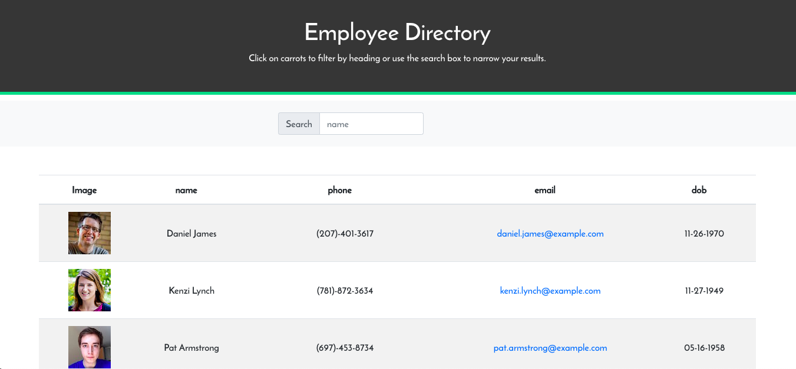
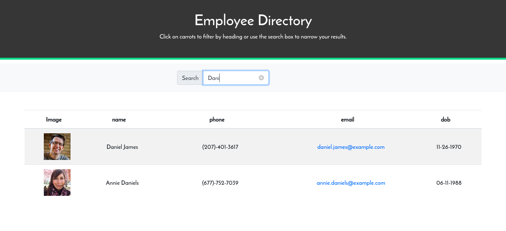
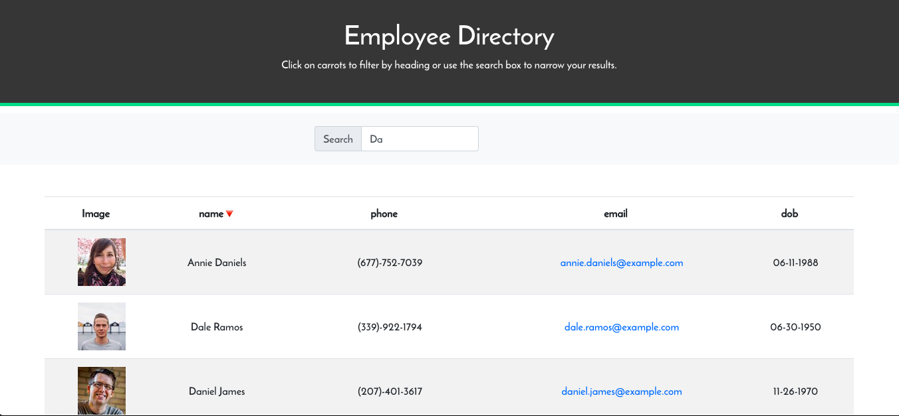
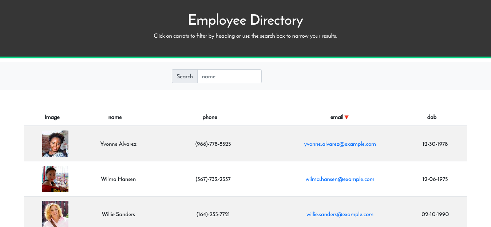

# Employee Directory

## Purpose

The purpose of this project is to create a functional employee directory, which allows for you to search for a specific employee and or sort by name, phone, or email. 

## Functionality

Users are able to search for a specific employee or to sport the current display by name, phone number or email. 

## Contributing

Other Students and TA's, W3School, stack overflow

Pull requests are welcome. However, for major changes, please open an issue first to discuss what you would like to change. 

Please make sure to update tests as appropriate.

## Links

Page URL: https://serene-waters-42875.herokuapp.com/

Github Repo: https://github.com/cmarshman/employee_directory

## Images

## License
MIT License

Copyright (c) [2020] [Cory_Marshman]

Permission is hereby granted, free of charge, to any person obtaining a copy of this software and associated documentation files (the "Software"), to deal in the Software without restriction, including without limitation the rights to use, copy, modify, merge, publish, distribute, sublicense, and/or sell copies of the Software, and to permit persons to whom the Software is furnished to do so, subject to the following conditions:

The above copyright notice and this permission notice shall be included in all copies or substantial portions of the Software.

THE SOFTWARE IS PROVIDED "AS IS", WITHOUT WARRANTY OF ANY KIND, EXPRESS OR IMPLIED, INCLUDING BUT NOT LIMITED TO THE WARRANTIES OF MERCHANTABILITY, FITNESS FOR A PARTICULAR PURPOSE AND NONINFRINGEMENT. IN NO EVENT SHALL THE AUTHORS OR COPYRIGHT HOLDERS BE LIABLE FOR ANY CLAIM, DAMAGES OR OTHER LIABILITY, WHETHER IN AN ACTION OF CONTRACT, TORT OR OTHERWISE, ARISING FROM, OUT OF OR IN CONNECTION WITH THE SOFTWARE OR THE USE OR OTHER DEALINGS IN THE SOFTWARE.